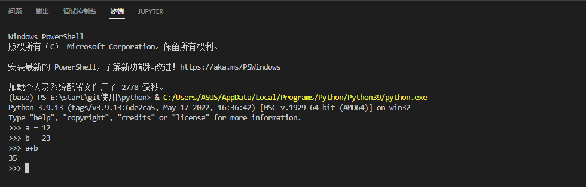

1. 创建文件夹
   

2. 选择解释器

   Ctrl+Shift+P 或者 View > Command Palette，打开命令面板，输入`Python: Select Interpreter`

3. 新建文件测试
   

4. 交互式解释器

   Ctrl + Shift + P 或者 View > Command Palette，打开命令面板
   输入`Python: Start REPL`
   

5. Debug
   可以改用Logpoints代替常用的print快速检查变量。Logpoints类似于断点，不同之处在于它将消息记录到控制台并且不会停止程序。

   

6. 虚拟环境中安装、使用软件包
