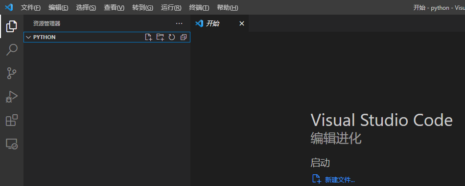
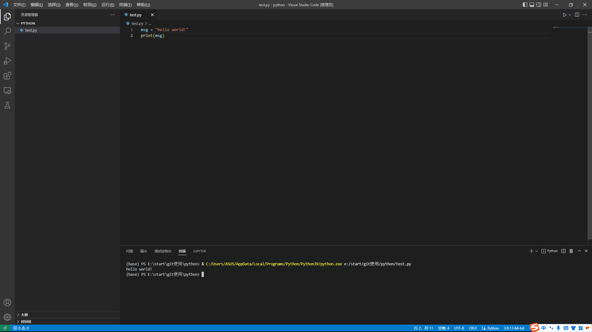
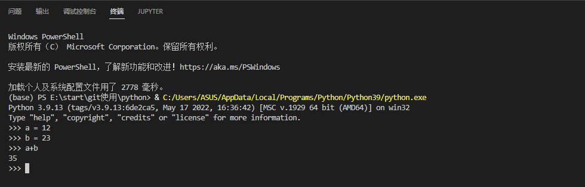
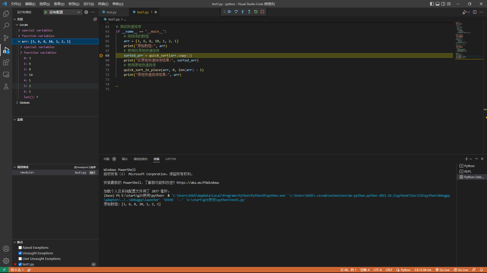
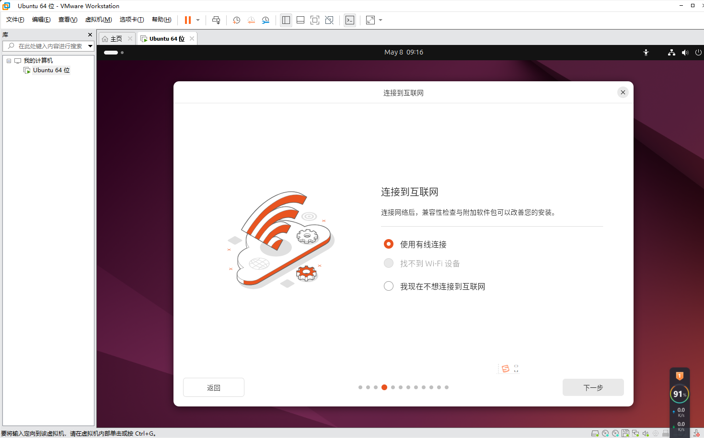
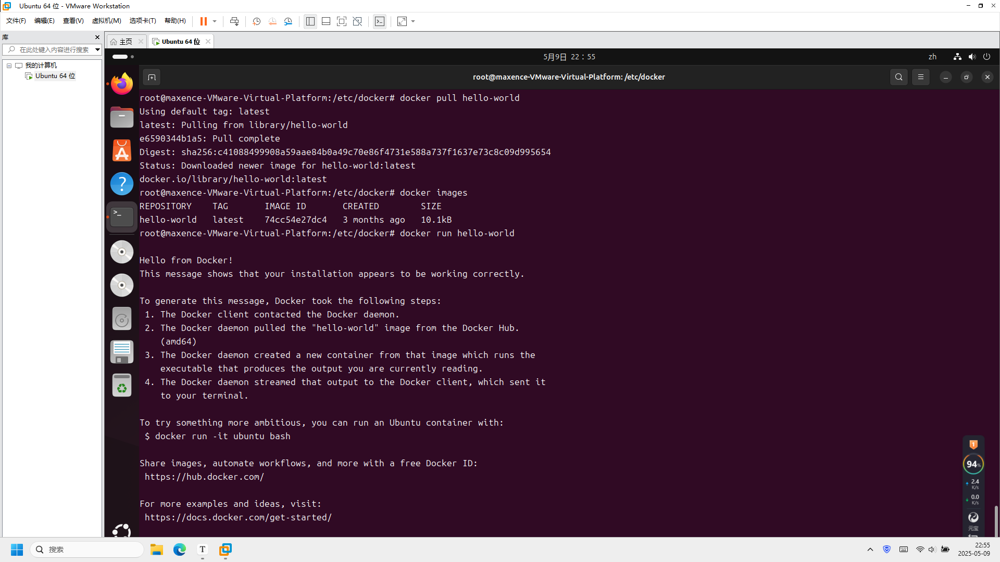

# VScode

1. 创建文件夹
   

2. 选择解释器

   Ctrl+Shift+P 或者 View > Command Palette，打开命令面板，输入`Python: Select Interpreter`

3. 新建文件测试
   

4. 交互式解释器

   Ctrl + Shift + P 或者 View > Command Palette，打开命令面板
   输入`Python: Start REPL`
   

5. Debug
   可以改用Logpoints代替常用的print快速检查变量。Logpoints类似于断点，不同之处在于它将消息记录到控制台并且不会停止程序。

   

6. 虚拟环境中安装、使用软件包

# Docker

## 安装过程：

1. 下载VMware

2. 安装ubunto

   遇到问题 没有wifi驱动 

   

   查找了很多解决方法都不行 最后按照这个教程总算有网了（但是仍然没有wifi 是有线连接）
   [解决vmware虚拟机安装ubuntu 无法连接wifi找不到wifi适配器问题_vmware怎样连接wifi-CSDN博客](https://blog.csdn.net/weixin_42251474/article/details/94737546)

3. 安装docker

3. 运行docker

## 学习

## docker架构
Docker 的架构设计使得开发者能够轻松地将应用程序与其所有依赖封装在一个可移植的容器中，并在不同的环境中一致地运行。
Docker 使用客户端-服务器 (C/S) 架构模式，使用远程 API 来管理和创建 Docker 容器。
Docker 容器通过 Docker 镜像来创建。

1. 客户端
   用户通过客户端发出命令。然后被发送到守护进程，由守护进程执行操作
   常用命令：

​	`docker run`：运行容器。

​	`	docker ps`：列出正在运行的容器。

​	`				docker build`：构建 Docker 镜像。

​	`	docker exec`：在容器中执行命令。

2. 守护进程
   Docker 守护进程监听来自 Docker 客户端的请求，并且通过 Docker API 执行这些请求。守护进程将负责容器、镜像等 Docker 对象的管理，并根据请求的参数启动容器、删除容器、修改容器配置等。

3. **Docker 容器**

   容器是从 Docker 镜像启动的，包含了运行某个应用程序所需的一切——从操作系统库到应用程序代码。容器在运行时与其他容器和宿主机共享操作系统内核，但容器之间的文件系统和进程是隔离的
   启动一个容器：docker run -d ubuntu

5. Docker 镜像
   是容器的只读模板。每个镜像都包含了应用程序运行所需的操作系统、运行时、库、环境变量和应用代码等。镜像是静态的，用户可以根据镜像启动容器。

6. Docker 仓库
   是用来存储 Docker 镜像的地方，最常用的公共仓库是 **Docker Hub**。用户可以从 Docker Hub 下载镜像，也可以上传自己的镜像分享给其他人。除了公共仓库，用户也可以部署自己的私有 Docker 仓库来管理企业内部的镜像。
   推送镜像到 Docker Hub：docker push <username>/<image_name>

7. **Docker Compose**
   用于定义和运行多容器 Docker 应用的工具

8. **Docker Swarm**

   管理多节点 Docker 集群。

   通过调度器管理容器的部署和扩展。

9. docker网络
   - 管理容器间的网络通信。
   - 支持不同的网络模式，以适应不同场景下的需求。

10.  **Docker 卷（Docker Volumes）**
    是一种数据持久化机制，允许**数据在容器之间共享**，并且独立于容器的生命周期。与容器文件系统不同，卷的内容不会随着容器的销毁而丢失，适用于数据库等需要持久存储的应用。

## Docker使用

1. helloworld

   docker run ubuntu:15.10 /bin/echo "Hello world"

   - **docker:** Docker 的二进制执行文件。
   - **run:** 与前面的 docker 组合来运行一个容器。
   - **ubuntu:15.10** 指定要运行的镜像，Docker 首先从本地主机上查找镜像是否存在，如果不存在，Docker 就会从镜像仓库 Docker Hub 下载公共镜像。
   - **/bin/echo "Hello world":** 在启动的容器里执行的命令

​		Docker 以 ubuntu15.10 镜像创建一个新容器，然后在容器里执行 bin/echo "Hello world"，然后输出结果。

2. 运行交互式的容器
   **docker run -i -t ubuntu:15.10 /bin/bash**

   - -t: 在新容器内指定一个伪终端或终端。

   - -i: 允许你对容器内的标准输入 (STDIN) 进行交互。

   **cat /proc/version**查看当前系统的版本信息
   **ls**查看当前目录下的文件列表
   **exit**或者**CTRL+D** 来退出容器。

3. 启动容器（后台模式）
   创建一个以进程方式运行的容器：docker run -d ubuntu:15.10 /bin/sh -c "while true; do echo hello world; sleep 1; done"

4. 镜像命令：

​	docker images  #查看所有本地主机的镜像
​	docker search 镜像名           #搜索镜像
​	docker pull 镜像名 [标签]      #下载镜像（如果不写tag，默认是latest）
​	docker rmi 镜像名 [标签]       #删除镜像    docker rmi -f $(docker images -aq)  删除全部镜像

​	docker tag  镜像名:版本   新镜像名:版本    #复制镜像并且修改名称
​	docker commit  -a "xxx"  -c "xxx" 镜像ID 名字：版本   #提交镜像 
​		-a :提交的镜像作者；
​		-c :使用Dockerfile指令来创建镜像；
​		-m :提交时的说明文字；

​	docker load -i    /xxx/xxx.tar         #导入镜像
​	docker save -o   /xxx/xxx.tar          #保存一个镜像为一个tar包	

5. 容器命令

   docker run [可选参数] image 命令 #启动容器（无镜像会先下载镜像）
   #参数说明
   --name = "Name"   容器名字
   -c   后面跟待完成的命令
   -d   以后台方式运行并且返回ID，启动守护进程式容器
   -i   使用交互方式运行容器，通常与t同时使用
   -t   为容器重新分配一个伪输入终端。也即启动交互式容器
   -p   指定容器端口    -p 容器端口:物理机端口  映射端口
   -P   随机指定端口
   -v   给容器挂载存储卷

   docker build  #创建镜像        -f：指定dockerfile文件路径   -t：镜像名字以及标签
   docker logs 容器实例的ID          #查看容器日志
   docker rename 旧名字  新名字      # 给容器重新命名
   docker top    容器实例的ID                  #查看容器内进程
   docker ps -a                    #列出所有容器（不加-a就是在运行的）
   docker rm      容器实例的ID                 #删除容器（正在运行容器不能删除，除非加-f选项）
   docker kill  容器实例的ID        #杀掉容器
   docker history   容器实例的ID    #查看docker镜像的变更历史
   docker start 容器实例的ID        #启动容器
   docker restart 容器实例的ID       #重启容器
   docker stop 容器实例的ID         #停止正在运行的容器
   docker attach /docker exec  容器实例的ID   #同为进入容器命令，不同的是attach连接终止会让容器退出后台运行，而exec不会。并且，docker attach是进入正在执行的终端，不会情动新的进程，而docker exec则会开启一个新的终端，可以在里面操作。
   docker image inspect  容器名称：容器标签       #查看容器内源数据
   docker cp  容器id：容器内路径   目的主机路径           #从容器内拷贝文件到主机（常用）或者从主机拷贝到容器（一般用挂载）
   exit                           #直接退出容器 
   crlt + P + Q                   #退出容器但是不终止运行
